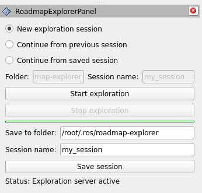

<!-- <div align="center">
  
</div> -->
## Roadmap-Explorer: A fast and reliable roadmap-based robot exploration module

This repository contains the complete implementation of the exploration algorithm for UGVs that I've developed over the course of the last 15 months.

## Citations:
If this work was useful to you, please consider citing the following [paper](https://papers.ssrn.com/sol3/papers.cfm?abstract_id=5238498) which contain the theoretical background of the algorithm.

> S. Saravanan, A. Bains, C. Chanel, D. Vivet: "FIT-SLAM 2: Efficient 3d Exploration with Fisher Information and Traversability Based Adaptive Roadmap"
 


This GIF was recorded during an exploration session at the [Clutterbot](https://www.clutterbot.com/) office.

## Introduction:

Roadmap explorer contains an exploration algorithm that primarily builds on top of the frontier exploration approach, but with a lot more ofcourse :)

This exploration framework primarily provides the following key advantages when compared to other frameworks out there.
1. End to end support to run with Nav2 (including Nav2 lifecycle and a behavior tree plugin to run with your custom behavior trees!)
2. An exploration framework that scales well with the size of the map: successful exploration sessions have been recorded upto 3,520 sq.m (~37,000 sq.ft). However, I don't believe that's the limit. Since the Frontier search and the TSP solvers are limited to a specified radius, it can potentially explore endlessly provided the SLAM supports it.
3. Something that's efficient: The average computational load on a standard platform such as the Jetson Xavier is limited to 10% of a single core of the CPU during regular exploration and spikes of upto 20-25% during global repositioning.
4. Utility features: There are a few important features that are included as a part of this package. Namely:
    - Ability to save exploration sessions (explored map as well as the constructed roadmap) in between runs and to continue exploring from where you left off last time.
    - Explore in localisation only mode: In certain use cases, when the robot is running in localisation only mode, it might still need to explore the environment. For example, to find new objects to pickup, clean and tidy or to re-explore the area with a secondary sensor on board such as a camera to detect tags / visual landmarks. This is well supported within this framework with the ability to configure different FOVs.
    - An RViz plugin that can be used to command the exploration server with your preferred method as well as to save and load past sessions.
5. (Probably the most important): The result is a much more structured exploration than most other popular frameworks I've tried out there. As a result, the total time taken to explore the environment is much lower. Roughly 25% faster than [GB-Planner 2](https://github.com/ntnu-arl/gbplanner_ros), 45% faster than [NBVP](https://github.com/ethz-asl/nbvplanner) or [frontier based approaches](https://github.com/paulbovbel/frontier_exploration) that are greedy in nature and 30% imporovement when comparted to approaches that couple arrival utility with path length [FIT-SLAM](https://ieeexplore.ieee.org/document/10553174). This framework is also the most computationally efficient among the other Frontier based approaches that I've tried out.
6. If there are major loop closures and the underlying map changes significantly, a mode that also aligns the frontier roadmap with the SLAM's pose graph to correct overtime with the SLAM is also available.

## More experiments outdoor:
|  |  |
|-------------------------|-------------------------|

This experiment was done outdoors at BITS Pilani, India. The image on the right shows the generated 2.5D map.

## The overall exploration system:


## Run the exploration with the turtlebot simulation!

This project currently only supports humble. Please follow the docs [here](https://docs.nav2.org/getting_started/index.html) to setup your turtlebot3 simulation. Once you are able to navigate the robot around, you can follow the steps below:

1. Clone this repository using the following commands:
```bash
cd && mkdir -p exploration_ws/src && cd exploration_ws/src
git clone https://github.com/suchetanrs/roadmap-explorer.git
cd .. && colcon build --symlink-install
source install/setup.bash
```

2. Run the turtlebot3 simulation using the following command:
```
ros2 launch nav2_bringup tb3_simulation_launch.py
```

3. Set the `/initialpose` on RViz to start localisation.

4. On a new terminal, launch the exploration module:
```
ros2 launch roadmap_explorer tb3_exploration.launch.py
```

Watch it explore!

## The included RViz plugin:

The module ships with an RViz plugin that can be used to command the exploration server with your preferred method as well as to save and load past sessions.

1. "New exploration session" button will start a new exploration session (a clean roadmap and a fresh exploration map in case of localisation only mode).
2. "Continue from previous session" will start the exploration from it left off. This does not write the exploration data to the disk and is useful when you simply want to pause and resume the session.
3. Save session will save the exploration data (Explored map and the constructed navigation roadmap) to the disk. This allows users to restart exploration upon clicking the "Continue from saved session" button before starting the exploration.
4. The "stop exploration" button merely pauses the exploration. No data is lost (yet) and you can freely continue exploring from the same place.

An image of the plugin is below:
<!--  -->
<div align="left">
  
</div>

## Known issues:

1. This module does not work well with FastDDS at the moment. Initial RCA suggests that when starting a "new exploration session", the costmap 2D's node persists even after the context has been cleared leading to the segfault. (See [here](https://github.com/ros2/rmw_fastrtps/issues/478)). It is recommended to use CycloneDDS for running this module with Nav2.

## Exposed topics / services:

TODO: